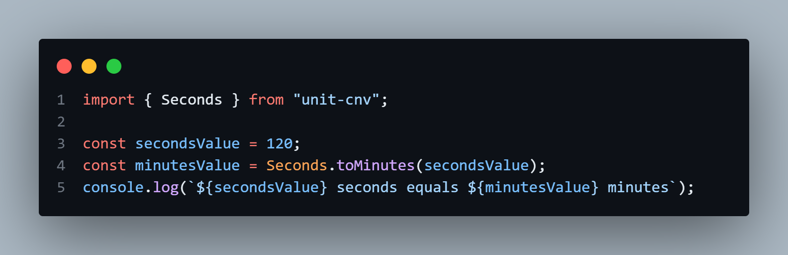

# Unit Converter

A TypeScript package to convert between different units of measurement, such as length, temperature, time, and more.

## Installation

To install the package, run the following command:

```
npm install unit-converter
```

## Usage

Import the necessary modules for the units you want to convert. For example, to convert time:



## Contributing

If you would like to contribute to this project, feel free to open an issue or submit a pull request.
